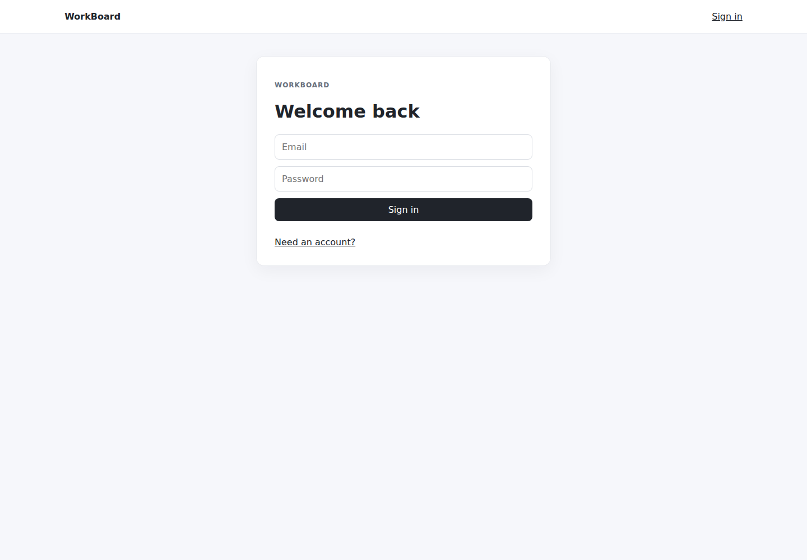
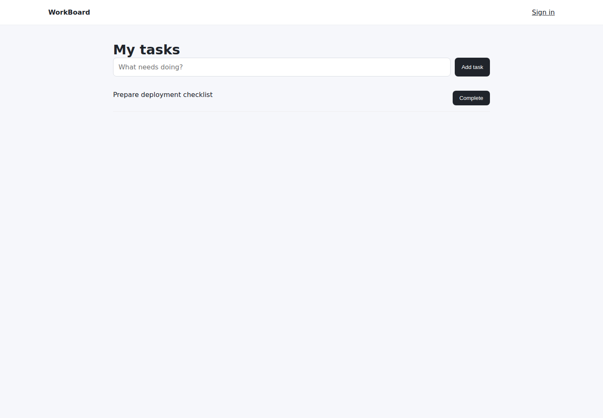

# WorkBoard

A Vue 3 + TypeScript task workspace that uses the **TaskForge NestJS API** as its backend. The project is intentionally small: the focus is on a clean API boundary, authentication flow, useful UI states, and maintainable frontend code.

## What it demonstrates

- Vue 3 + TypeScript + Vite
- Vue Router with protected routes
- Login and account creation against a NestJS API
- Bearer-token authentication
- Task creation and completion
- Loading, empty, validation, and API error states
- Responsive UI
- Vitest tests
- GitHub Actions build/test verification

## Architecture

```
Vue 3 / TypeScript
        |
        | REST + Bearer token
        v
TaskForge API (NestJS)
        |
        v
PostgreSQL
```

The backend lives in the separate **TaskForge API** repository so this repository stays focused on the client application. Run the API at `http://localhost:3000/api` or set `VITE_API_URL` to another instance.

## Run locally

```bash
npm install
npm run dev
```

Checks:

```bash
npm test
npm run build
```

## Screenshots

These screenshots are captured from the **running Vue + NestJS + PostgreSQL stack in GitHub Actions using Playwright**. They are not mockups or generated product images.

### Login



### Task workflow

The second capture shows a real account creating a task and completing it.



The CI job also runs the frontend tests/build, starts the real TaskForge API with PostgreSQL, executes the browser flow, and stores the screenshots as an artifact.

## Why this project exists

WorkBoard complements the NestJS backend and the React client in the portfolio. It shows the same API contract implemented with Vue rather than duplicating backend logic.
