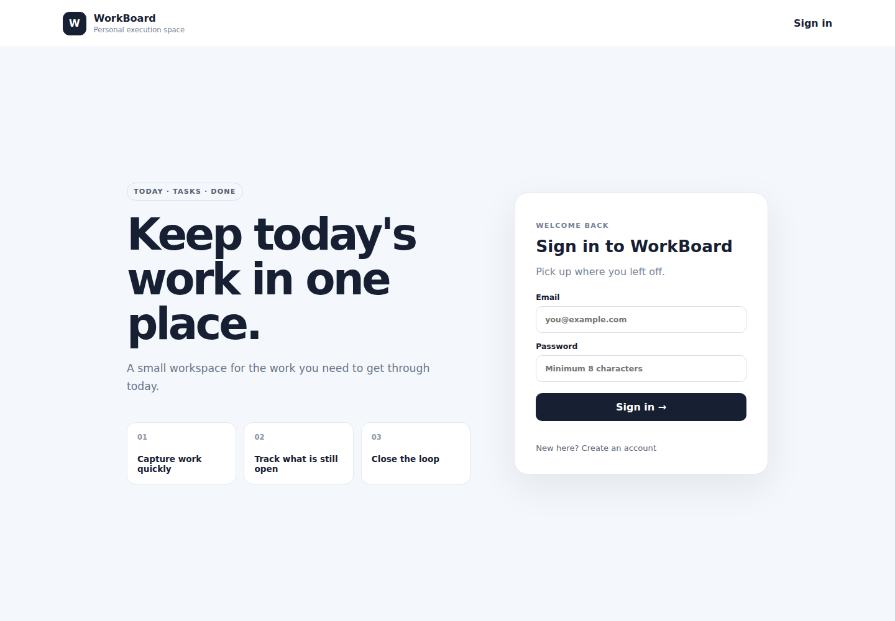
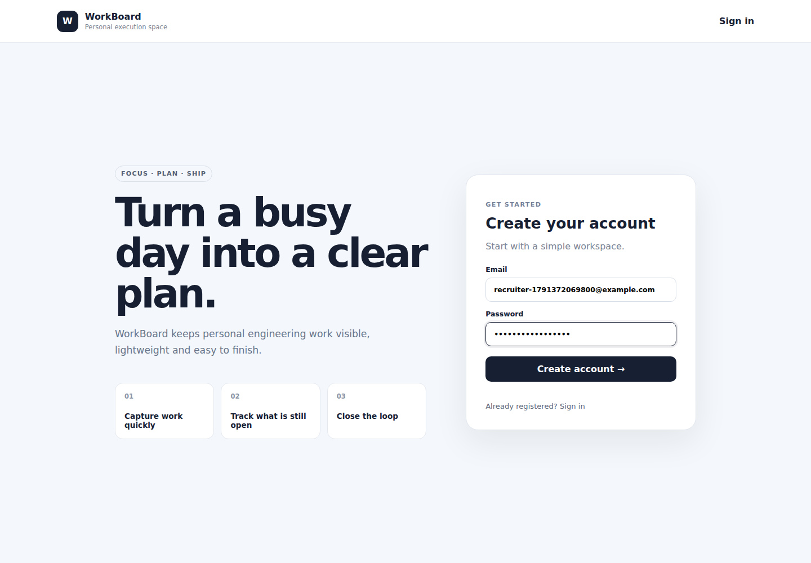
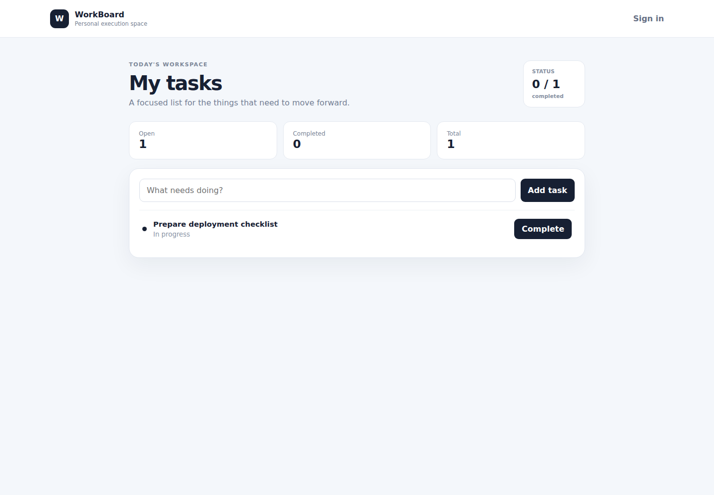
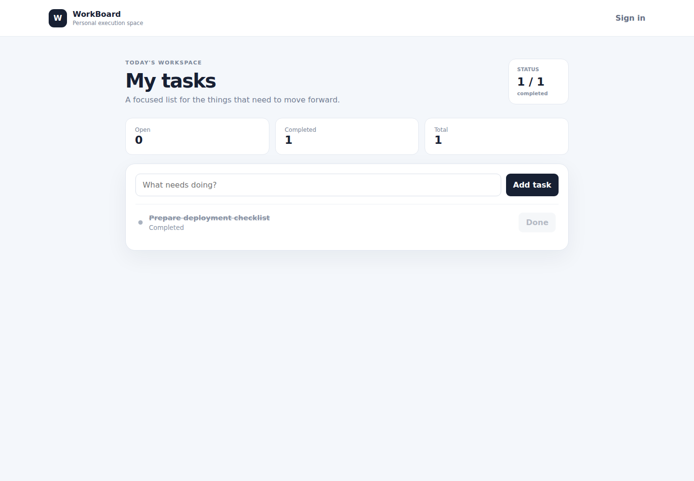

# WorkBoard

A Vue 3 + TypeScript task workspace built around a small NestJS API. WorkBoard is the portfolio project focused on **personal execution**: capture work, see priorities, and close tasks without unnecessary complexity.

## What it demonstrates

- Vue 3 + TypeScript + Vite
- Vue Router and protected application flow
- Sign in and account creation
- Bearer-token authentication
- Task creation and completion
- Dashboard metrics and useful empty/loading/error states
- Responsive UI
- Vitest tests
- GitHub Actions browser verification with Playwright

## Architecture

```
Vue 3 / TypeScript
        |
        | REST + Bearer token
        v
TaskForge API (NestJS)
        |
        v
PostgreSQL
```

The backend lives in the separate **TaskForge API** repository. Run it at `http://localhost:3000/api` or set `VITE_API_URL`.

## Run locally

```bash
npm install
npm run dev
npm test
npm run build
```

## Real application walkthrough

These screenshots are captured from the **running Vue + NestJS + PostgreSQL stack in GitHub Actions using Playwright**. They are real browser captures, not mockups.

### 1. Sign in



### 2. Create an account



### 3. Add a task



### 4. Complete the task



The CI pipeline tests/builds the frontend, starts the real API and PostgreSQL database, executes this browser journey, and uploads the screenshots as an artifact.

## Why this project exists

WorkBoard shows a focused Vue implementation with its own visual identity. It shares the backend contract with ClientHub, but the product experience is intentionally different: WorkBoard is a personal execution board rather than a client-delivery workspace.
